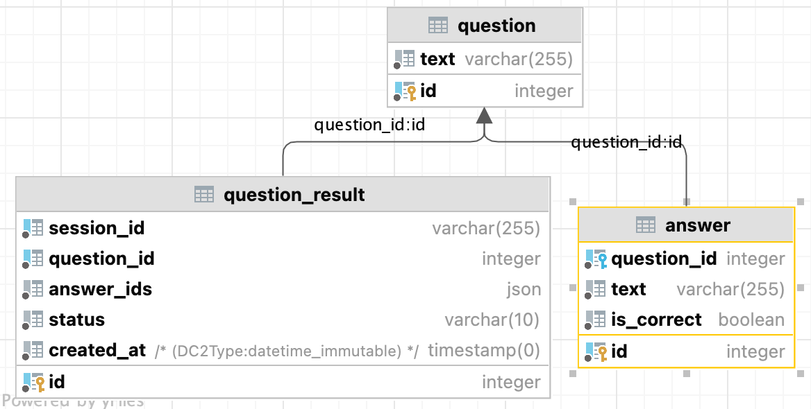

# quiz-app

### Setup
```shell
cp docker-compose.override.yml.dist docker-compose.override.yml
docker-compose up --build -d
docker-compose exec quiz_app sh
composer install
php bin/console doctrine:migrations:migrate
php bin/console doctrine:fixtures:load
```

Open: http://localhost:80

### Schema


